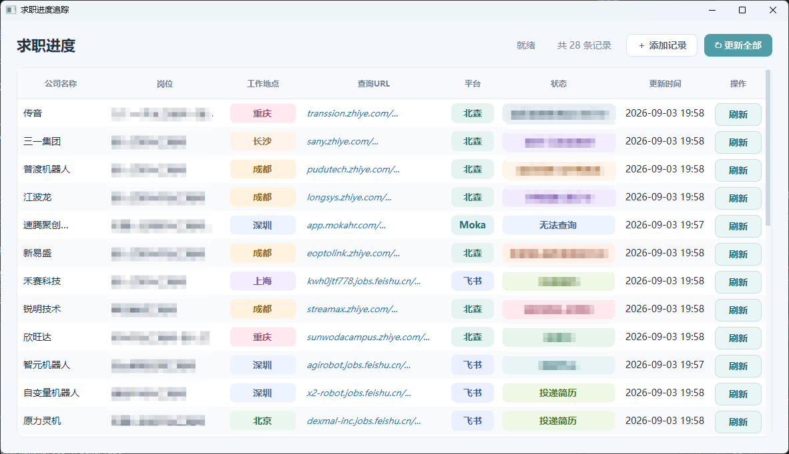

# Job Tracker

个人求职进度追踪桌面工具。程序使用 PyQt6 提供界面，使用 SQLite 保存投递记录，使用 Playwright 打开招聘网站并复用登录状态。

本项目适合个人在本地管理求职投递记录。招聘网站的登录信息和求职数据只保存在本机，不上传到服务器。

## 效果演示



桌面应用主界面支持查看投递公司、岗位、工作地点、招聘平台、当前状态和更新时间。

## 获取项目

### 使用 Git 克隆

安装 [Git](https://git-scm.com/downloads) 后，在终端执行：

```bash
git clone <项目仓库地址>
cd job_tracker_v8
```

将 `<项目仓库地址>` 替换为本项目实际的 Git 仓库地址。如果仓库目录名称不同，请进入实际目录。

### 下载 ZIP

在代码托管平台的项目页面点击“Code”或“代码”，选择“Download ZIP”或“下载 ZIP”。解压后，在终端进入解压得到的项目根目录。

## 功能概览

- 在表格中直接编辑公司、岗位、工作地点和查询 URL
- 编辑内容自动保存到 SQLite
- 工作地点历史记录和输入补全
- 自动识别北森、飞书、Moka 及其它招聘平台
- 支持单条刷新和后台串行更新全部记录
- 每家公司独立保存登录状态
- 首次登录或登录失效时打开可见浏览器
- 已登录时优先使用无头浏览器静默查询
- URL 单击打开网页，双击进入 URL 编辑
- 刷新后自动保存当前招聘状态和更新时间
- 状态变化时在界面顶部显示红色提醒
- 状态列支持手动修改
- 右键删除记录
- 批量更新自动跳过终态和标记为无需查询的记录
- 查询 URL、平台、地点和状态使用浅色圆角标签显示
- 调试阶段向终端输出刷新和异常日志

## 环境要求

- Windows、macOS 或 Linux
- Python 3.10 或更高版本
- 可用的 Chromium 浏览器运行环境

## 安装

确保当前终端位于项目根目录，也就是能够看到 `main.py` 和 `requirements.txt` 的目录，然后执行：

```powershell
pip install -r requirements.txt
playwright install chromium
```

如果系统中还没有 Python，请先从 [Python 官网](https://www.python.org/downloads/) 安装 Python 3.10 或更高版本。Windows 安装时建议勾选“Add Python to PATH”。

如果使用 Conda，先激活项目环境：

```powershell
conda activate jobtracker
pip install -r requirements.txt
playwright install chromium
```

## 启动

必须从项目根目录启动：

```powershell
python main.py
```

不要在 `src\ui` 等子目录执行启动命令；项目根目录是包含 `main.py` 的目录。

如果系统同时安装了多个 Python，也可以使用：

```powershell
python3 main.py
```

Windows 下如果使用虚拟环境，先激活环境再启动：

```powershell
\.venv\Scripts\activate
python main.py
```

首次启动后会自动创建 `data/jobs.db` 和 `data/profiles/`。

## 界面操作

### 添加记录

点击顶部“添加记录”，表格底部会增加一行。直接填写公司名称、岗位、工作地点和查询 URL。输入完成后内容会自动保存。

顶部记录数只统计公司名称不为空的记录，即使没有 URL 也会计入。

### 编辑工作地点

工作地点支持直接输入，也支持历史补全。输入已有地点的开头即可看到建议；新地点会自动加入历史记录。

### 编辑状态

状态是可编辑的圆角输入框。修改后会立即保存，并更新“更新时间”，同时写入状态历史。

### 单条刷新

点击对应记录最右侧的“刷新”按钮：

1. 检查公司名称和 URL 是否为空
2. 加载该公司的登录状态
3. 尝试无头访问并读取状态
4. 登录失效时打开可见浏览器
5. 登录成功后自动保存登录状态
6. 读取状态并更新表格

单条刷新始终保留，即使记录已经是终态，也可以手动强制刷新。

### 批量更新

点击顶部“更新全部”。任务会在后台按顺序逐个执行，一次只打开一个浏览器，避免多浏览器并发导致 profile 冲突或页面被关闭。

批量更新期间，再次点击“更新全部”或单条刷新会被忽略。界面不会阻塞，顶部会显示处理进度。

以下记录会自动跳过批量更新：

- URL 为空
- URL 或状态包含“无法查询”“跳过查询”“无需查询”
- 状态包含“流程终止”“已结束”“已完成”“已淘汰”“已撤回”等终态词
- 状态包含“感谢”或“谢谢”的结束提示

### 打开查询网页

- 单击查询 URL：打开可见浏览器查看
- 双击查询 URL：进入编辑模式，不打开浏览器

打开网页时会优先加载该公司的已保存登录状态。登录状态失效时，可以在浏览器中手动登录；关闭浏览器后最新登录状态会保存下来。

URL 在表格中显示为简略形式，例如 `app.mokahr.com/...`，鼠标悬停可以查看完整 URL。

### 删除记录

在记录所在行点击鼠标右键，选择“删除记录”，确认后删除该记录及关联的状态历史。

## 平台识别和状态解析

| 域名 | 平台 | 解析器 |
| --- | --- | --- |
| `zhiye.com` | 北森 | `src/parser/beisen.py` |
| `jobs.feishu.cn` | 飞书 | `src/parser/feishu.py` |
| `mokahr.com` | Moka | `src/parser/moka.py` |
| 其它域名 | 其它 | `src/parser/other.py` |

域名识别代码位于 `src/database.py` 的 `detect_platform()`。

状态解析器职责：

- 北森：优先读取“当前进度”和“投递进度”
- 飞书：优先读取“应聘记录”中的状态，支持异步渲染和多阶段流程
- Moka：读取状态、阶段、进度相关 DOM 字段，并支持常见申请状态
- 其它平台：优先读取“当前状态”“当前进度”“投递状态”等明确字段，再处理多阶段流程和状态相关 DOM

其它平台当前包括美团、华为、vivo、OPPO、汇川、海康、TP-LINK、联想等自建招聘网站。通用解析器位于 `src/parser/other.py`。

## 登录状态和隐私数据

每家公司使用独立目录保存轻量登录状态：

```text
data/profiles/<公司名>/state.json
```

状态文件可能包含 Cookies、LocalStorage、Token 和招聘网站登录信息。

数据库位置：

```text
data/jobs.db
```

数据库保存公司、岗位、工作地点、查询 URL、平台、当前状态、更新时间、浏览器状态文件路径和状态历史。

`data/` 下的所有本地数据已通过根目录 `.gitignore` 忽略，不应提交到代码仓库。

## 项目结构

```text
.
├── main.py                  # 项目启动入口
├── requirements.txt         # Python 依赖
├── .gitignore               # 隐私数据和本地文件忽略规则
├── data/
│   ├── jobs.db              # 本地数据库，运行后自动生成
│   └── profiles/            # 各公司登录状态
└── src/
    ├── main.py              # Qt 应用入口
    ├── database.py          # SQLite、去重、平台识别和状态历史
    ├── browser/
    │   └── manager.py       # Playwright、登录和浏览器生命周期
    ├── parser/
    │   ├── beisen.py        # 北森解析器
    │   ├── feishu.py        # 飞书解析器
    │   ├── moka.py          # Moka 解析器
    │   └── other.py         # 其它平台通用解析器
    └── ui/
        └── main_window.py   # PyQt6 主界面
```

## 数据规则

### 自动保存

公司、岗位、工作地点和 URL 在表格编辑完成后自动写入数据库。平台由 URL 自动计算，更新时间由程序维护。

### 防重复

同一个“公司名称 + 查询 URL”只能存在一条记录。编辑时产生重复，程序会合并记录并保留已有记录 ID。

### 状态变更

刷新前后状态不一致时，会更新状态栏提示、将状态文字显示为红色、更新数据库状态并写入状态历史。手动修改状态同样会写入状态历史，因此后续刷新会与手动状态比较。

## 调试日志

当前为开发阶段，终端会输出应用启动、刷新按钮、公司平台 URL、登录状态文件、浏览器启动、页面加载、状态解析、批量进度和异常堆栈。

示例：

```text
19:10:29 [INFO] src.main: 应用启动
19:10:32 [INFO] src.ui.main_window: 收到单条刷新请求: job_id=27
19:10:32 [INFO] src.browser.manager: 浏览器任务: company=vivo platform=其他 url=...
19:10:35 [INFO] src.browser.manager: 无头状态结果: company=vivo status=简历初筛-进行中
```

## 常见问题

### 浏览器没有弹出

确认点击的是表格最右侧“刷新”按钮，或单击查询 URL。双击 URL 是编辑操作，不会打开浏览器。

### 第一次刷新较慢

首次刷新需要启动 Chromium。没有登录状态时会直接打开可见浏览器，登录完成后会保存状态，后续刷新通常更快。

### 浏览器刚打开就关闭

检查终端日志。如果页面状态被误识别、登录流程异常或 Playwright 抛出错误，请提供从“开始刷新”到异常结束的完整日志。

### 出现 `TargetClosedError`

用户主动关闭“查看网页”窗口属于正常操作。批量更新已改为串行执行，避免多个浏览器同时运行导致目标页面被关闭。

### 出现 `Could not parse stylesheet`

确认使用的是最新代码。项目中的动态 QLineEdit 样式已使用合法 Qt Style Sheet 格式。

### 状态显示不准确

请提供招聘网页截图、对应查询 URL、从刷新开始到状态返回的完整终端日志，以及页面中真实显示的状态文字。不同公司的自建招聘平台页面结构可能不同，通用解析器会持续兼容新的页面结构。

## 注意事项

- 不要把 `data/jobs.db` 或 `data/profiles/` 分享给他人
- 不要把登录状态文件提交到 Git 仓库
- 批量更新期间不要关闭正在使用的浏览器窗口
- 招聘网站页面结构变化后，解析结果可能需要适配
- 页面登录、验证码和扫码授权仍需要用户按网站要求完成
